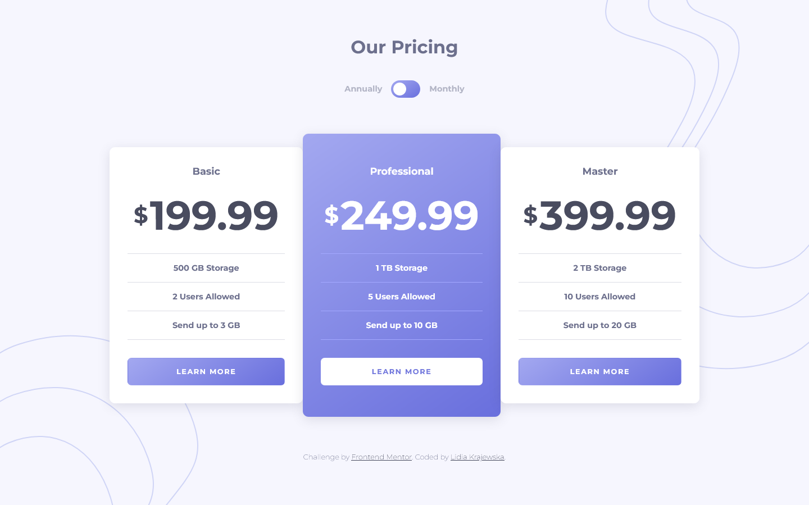

# Frontend Mentor - Pricing component with toggle solution

This is a solution to the [Pricing component with toggle challenge on Frontend Mentor](https://www.frontendmentor.io/challenges/pricing-component-with-toggle-8vPwRMIC). Frontend Mentor challenges help you improve your coding skills by building realistic projects.

## Table of contents

- [Overview](#overview)
  - [The challenge](#the-challenge)
  - [Screenshot](#screenshot)
  - [Links](#links)
- [My process](#my-process)
  - [Built with](#built-with)
  - [What I learned](#what-i-learned)
  - [Useful resources](#useful-resources)
- [Author](#author)

## Overview

### The challenge

Users should be able to:

- View the optimal layout for the component depending on their device's screen size
- Control the toggle with both their mouse/trackpad and their keyboard

### Screenshot

### Links

- Solution URL: [https://github.com/lidiakrajewska/pricing-component-with-toggle-master](https://github.com/lidiakrajewska/pricing-component-with-toggle-master)
- Live Site URL: [https://lidiakrajewska.github.io/pricing-component-with-toggle-master/](https://lidiakrajewska.github.io/pricing-component-with-toggle-master/)

## My process

### Built with

- Semantic HTML5 markup
- SCSS
- Flexbox
- Mobile-first workflow

### What I learned

- creating a custom toggle switch

### Useful resources

- [W3school](https://www.w3schools.com/howto/howto_css_switch.asp) - This showed me how to create a custom toggle switch
- [linuxhint](https://linuxhint.com/check-if-checkbox-is-checked-using-javascript/) - Here I checked how to check toggle state in JS
- [stack overflow](https://stackoverflow.com/questions/9612758/add-a-css-border-on-hover-without-moving-the-element) - The solution to changing size of the cards when adding border on focus

## Author

- LinkedIn - [Lidia Krajewska](https://www.linkedin.com/in/lidia-krajewska-02512a1a7/)
- Frontend Mentor - [@lidiakrajewska](https://www.frontendmentor.io/profile/lidiakrajewska)
